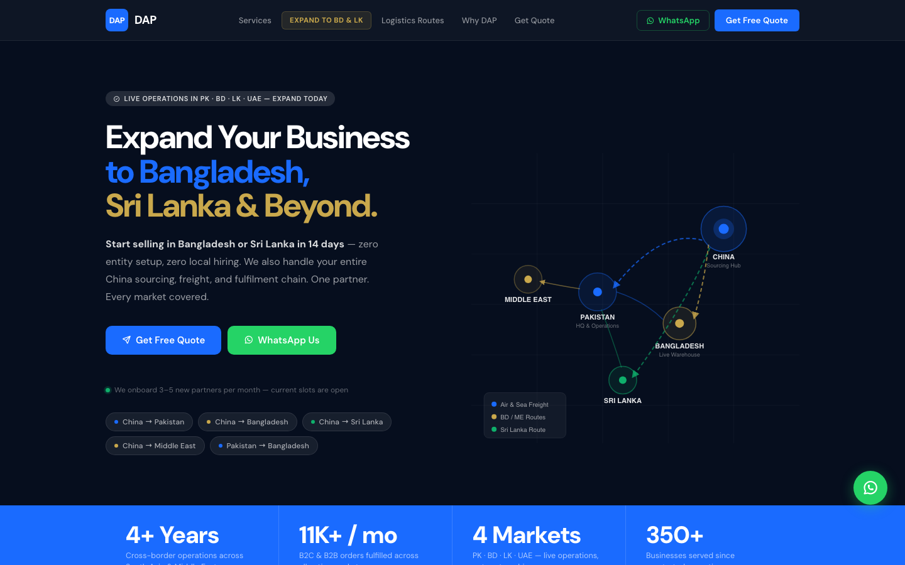
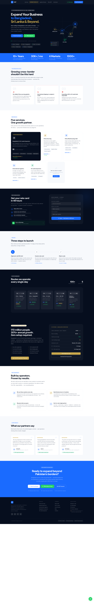
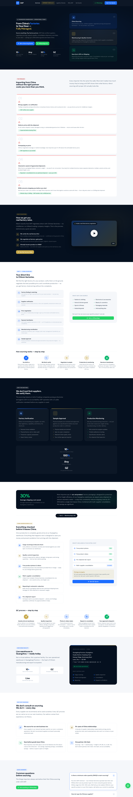
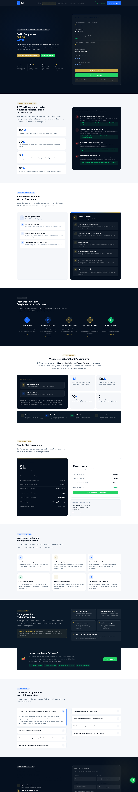
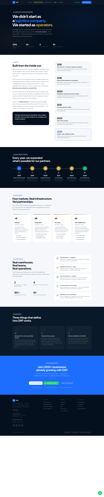

<p align="center">
  
</p>

<h1 align="center">Bespoke WordPress Themes</h1>

<h3 align="center">Custom WordPress engineering pixel-perfect UI</h3>

<p align="center">
  <strong>Muhammad Hamid</strong><br>
  Senior Full Stack Developer · WordPress · PHP · HubSpot · Performance
</p>

<p align="center">
  <a href="https://www.linkedin.com/in/muhammad-hamid-jamil/">LinkedIn</a>&nbsp;·&nbsp;
  <a href="https://github.com/muhammad-hamid-jamil">GitHub</a>&nbsp;·&nbsp;
  <a href="https://websolsolutions.com/">Websol Solutions</a>&nbsp;·&nbsp;
  <a href="mailto:muhammadhamidjamil0@gmail.com">Email</a>
</p>

<p align="center">
  
  
  
  
  
</p>

---

## DAP Logistics — Enterprise WordPress Theme

I built a **fully custom WordPress theme** for a cross-border logistics & e-commerce platform operating across **Pakistan, Bangladesh, Sri Lanka, and UAE**.

CRM-connected lead forms & Native SEO, Admin-friendly content editing. **No page builders. One plugin.**

---


## Performance & architecture

I engineered this theme for **speed and maintainability** not drag-and-drop convenience.

| Decision | Impact |
|----------|--------|
| **Custom theme, zero page builder** | No Elementor/Divi bloat lean asset loading |
| **ACF as the only content plugin** | Full admin control without 20+ plugins |
| **Per-page CSS & JS bundles** | Only load what each template needs |
| **Template-parts architecture** | 14 modular sections on home alone clean separation |
| **Server-side HubSpot proxy** | Custom form UI preserved; API submit with IP + tracking context |
| **Native SEO module** | Meta, OG, Twitter Cards, Schema.org Yoast-compatible |

**Result:** 95+ mobile PageSpeed score on production pages with live forms and animations.

---

## UI showcase Desktop

<details open>
<summary><strong>Homepage — full page</strong></summary>
<br>

</details>

<details>
<summary><strong>China Sourcing — full page</strong></summary>
<br>

</details>

<details>
<summary><strong>Bangladesh Expansion — full page</strong></summary>
<br>

</details>

<details>
<summary><strong>About — full page</strong></summary>
<br>

</details>

---

## Technical highlights

### Custom ACF content layer

I built a safe editing pattern layout locked in PHP partials, copy editable via ACF:

```php
<h2><?php demo_text( 'hero_heading', 'Get..... hours' ); ?></h2>
```

Empty field → design default shows. Updated field → new copy only. **Layout never breaks.**

→ [`showcase/safe-content-pattern.php`](showcase/safe-content-pattern.php)

### HubSpot Forms API integration

Custom-designed forms on the frontend. Submissions routed through WordPress AJAX to HubSpot Forms API v3 — no iframe embeds, no UI compromise.

→ [`showcase/hubspot-form-submit.php`](showcase/hubspot-form-submit.php)

### Theme structure

```
dap-logistics/
├── template-parts/     # Section-level PHP — one file per UI block
├── assets/css|js/      # Page-scoped bundles
├── inc/
│   ├── helpers.php     # dap_text(), dap_wa_url(), partial loader
│   ├── hubspot.php     # CRM form proxy + tracking
│   ├── seo.php         # Meta, OG, Schema.org
│   └── acf-fields/     # 400+ labeled admin fields
└── page-templates/     # Home, About, China, BD, Legal
```

→ [`docs/architecture-overview.md`](docs/architecture-overview.md)

---

## Tech stack

**Languages:** PHP 7.4+ · JavaScript (ES6) · HTML5 · CSS3  
**CMS:** WordPress 6.x · Advanced Custom Fields  
**CRM:** HubSpot Forms API v3 · Tracking script  
**SEO:** Custom meta module · Open Graph · JSON-LD Schema  
**Frontend:** DM Sans · Tabler Icons · Vanilla JS (no jQuery dependency)  
**Integrations:** WhatsApp deep links · Dynamic legal content · REST-ready architecture

---

## More of my work

| Project | Stack |
|---------|--------|
| [Aldar Real Estate — WP REST API](https://github.com/muhammad-hamid-jamil/Aldar-Real-Estate-WordPress-REST-API) | WordPress · REST API · CRM |
| [Stegbar — Shopify Migration](https://github.com/muhammad-hamid-jamil/stegbar-shopify-migration) | Shopify · Episerver migration |
| [Taylr Payment Gateway — WooCommerce](https://github.com/muhammad-hamid-jamil/Autify-Digital-Taylr-Payment-Gateway-WooCommerce-) | WooCommerce · Payments · 3DS |
| [Glow Vibes — Shopify Store](https://github.com/muhammad-hamid-jamil/Glow-Vibes-Cosmetic-Shopify) | Shopify · Custom sections |

---

## Work with me

I build **Bespoke WordPress Themes** for companies that need real engineering not template customization.

Pixel-perfect design implementation · 90+ PageSpeed · CRM integrations · Custom admin panels · WooCommerce · Headless-ready architecture

<p align="center">
  <a href="https://www.linkedin.com/in/muhammad-hamid-dev/"><strong>Connect on LinkedIn →</strong></a>
</p>

---

<p align="center">
  <sub>Built by <a href="https://github.com/muhammad-hamid-jamil"><strong>Muhammad Hamid</strong></a> · Senior Full Stack Developer · Lahore, PK</sub>
</p>
